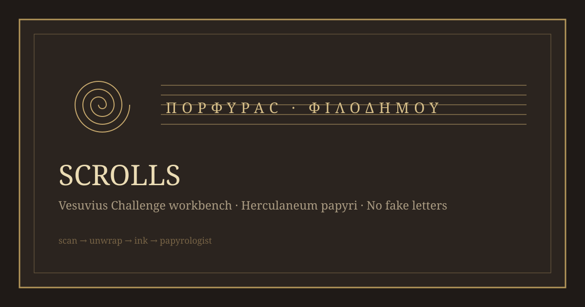

# Scrolls: Vesuvius Challenge workbench



Research notes, a run planner, and an experiment ledger for the [Vesuvius Challenge](https://scrollprize.org/): reading the carbonized Herculaneum papyri from X-ray CT scans.

**This repository does not claim that any letters have been found in any scroll.**
The `kit/` package plans and records runs of the official open-source pipeline ([ScrollPrize/villa](https://github.com/ScrollPrize/villa)). It does not reimplement that pipeline. Prize amounts, deadlines and eligible scrolls are a dated snapshot (checked 2026-10-06); [scrollprize.org/prizes](https://scrollprize.org/prizes) wins if they disagree.

## Start here (recommendation)

If you are new, **go for Progress Prizes first, then First Letters**. Leave the Grand Prize for later.

1. **Read [`docs/start-here.md`](docs/start-here.md).** It is the plain-language path from "no idea" to a first submission, with what each step costs.
2. **Join the [Vesuvius Challenge Discord](https://discord.gg/V4fJhvtaQn).** Registration there is a condition of winning the Grand Prize, and most announcements land there first.
3. **On a Mac?** Read [`docs/mac.md`](docs/mac.md). VC3D, rendering and flattening run natively on Apple Silicon; ink inference runs on the CPU unless you use an open villa PR.
4. **Run the control.** Reproduce letters on PHerc. 0139 segment w035, which the released ink models were trained on. If you cannot see letters there, your pipeline is broken. If you can, that proves only that the pipeline runs: the clean letters are the model's training labels, reproduced ([log](docs/logs/2026-10-07-w035-cpu.md)). `python -m kit plan PHerc0826` prints the commands.
5. **Win something small and real.** In July and August 2026, 28 Progress Prizes went to merged bug fixes, QA tools, benchmarks, and one honest end-to-end First Letters run that found nothing but published its commands and costs. See [`docs/state-of-play.md`](docs/state-of-play.md).

Most of the money ($1.55M of the $2.14M pool) needs an image that papyrologists can read. Raw compute does not buy that by itself. In August and September 2026 at least five independent teams, at least three of them openly Claude-driven, ran the released 9 µm ink models on eligible scrolls (one survey covered all 21 that lacked catalog segments) and published **nulls**. The bottleneck is keeping a surface on one papyrus sheet, and getting ink models to generalize across scrolls. It is not GPU hours. See [`docs/compute.md`](docs/compute.md).

## Quick start (kit)

Python **3.10+**, standard library only (except `verify`, which reads TIFFs with numpy and tifffile from villa's environment). The heavy pipeline (VC3D, PyTorch, ink models) is installed from villa; `doctor` tells you what is missing.

```bash
# from repo root
python -m kit prizes                      # open prizes, deadlines, eligible scrolls (dated snapshot)
python -m kit doctor                      # GPU, disk, uv/docker/git, VILLA and VC_BIN paths
python -m kit plan PHerc0826              # control + target commands for one eligible scroll
python -m kit plan PHerc0800 --batch 1    # 8.64 um scan: prints the resampling note
python -m kit plan PHerc0826 --mac        # Apple Silicon: VC3D.app tools, CPU or MPS inference
python -m kit cost --gpu-hours 6.5 --rate 1.10
python -m kit run init p0826-a --scroll PHerc0826 \
  --question "Does ink_9um show rows on a hand-refined GrowPatch near the outer wraps?" \
  --readout "Rows of 2-4 mm strokes in forward depth, absent in reverse, on both seeds"
python -m kit run cost p0826-a --usd 7.15 --what "A10, 6.5 h"
python -m kit run status p0826-a running
python -m kit run check p0826-a
python -m kit verify cpu.tif mps.tif --control cpu_reverse.tif   # needs numpy + tifffile (villa's env)
python -m kit fetch w035 data/w035_9um.zarr   # mirror a public bucket prefix over HTTPS, resumable
python -m kit fetch w045 data/w045_9um.zarr   # held out from ink_9um and v8in: the generalization check
python -m kit rowscore f42.tif f43.tif --reverse r42.tif r43.tif --voxel-um 9.362   # row triage score
bash scripts/mac-verify.sh                    # Apple Silicon: CPU vs MPS on the control, one command
python -m unittest discover -s tests -v
```

`plan` prints commands; it never runs them. They are copied from the official [ink detection tutorial](https://scrollprize.org/tutorial5), with each eligible volume's real S3 path resolved from the public bucket. The `run` ledger writes `experiments/<slug>/run.json`, which is gitignored. It hashes your readout rule when the run is created, so a rule edited after you looked is caught by `check`. It refuses to mark a submitted candidate `published` until the prize has been announced: the prize terms forbid going public first.

## The open prizes (snapshot 2026-10-06)

| Prize | Money | Deadline | What wins |
| --- | --- | --- | --- |
| [2027 Grand Prize](https://scrollprize.org/prizes#2027-grand-prize) | $800k / $100k / $50k / $50k | 25 Jun 2027 | Fully unroll one of 13 sealed scrolls; at least 70% of each counted column's preserved characters legible |
| [First Letters](https://scrollprize.org/prizes#first-letters-prizes) | $50k per scroll, max 10 | 25 Jun 2027 | First team to show 10 legible letters in a single 4 cm² area of one of 22 eligible scrolls |
| [PHerc. Paris 4 title](https://scrollprize.org/prizes#first-title-prize) | $50k | 25 Jun 2027 | A papyrologist-readable image of Scroll 1's title |
| [Progress Prizes](https://scrollprize.org/prizes#progress-prizes) | $20k best of month, plus $250 to $20k awards | monthly (next: 31 Oct 2026) | Open-source tools, models, datasets, fixes, reports that help read the scrolls |

All prizes require open-sourcing your method (permissive license) to accept the money. Details, submission contents and the eligible-scroll lists: [`docs/prizes.md`](docs/prizes.md).

## What this repo does / does not

| Does | Does not |
| --- | --- |
| Keep a dated, tested snapshot of open prizes and eligible volumes (`kit/data/`) | Replace the live prize page |
| Print the official control and First Letters commands per eligible scroll, with resolved S3 paths | Run VC3D, render surfaces, or run ink models itself |
| Check a machine against thresholds from published runs (12 GB GPU, 25 GB disk) | Guarantee a run fits; streaming caches grow by gigabytes |
| Record preregistered readout rules, costs and status transitions locally | Decide whether an image shows letters |
| Block publishing a candidate before the prize is announced | Submit anything to the Vesuvius Challenge for you |
| Summarize the pipeline, the state of play, and costs, with sources | Claim a reading, a title, or letters in any scroll |
| Point to villa, community tools, and published nulls | Fork or vendor villa |

## Repository layout

| Path | Role |
| --- | --- |
| [`kit/`](kit/) | Planner, doctor, prize snapshot and experiment ledger + CLI (`python -m kit`) |
| [`kit/data/prizes-2026-10-06.json`](kit/data/prizes-2026-10-06.json) | Dated prize snapshot: amounts, deadlines, 13 + 22 eligible volumes with S3 names |
| [`tests/test_kit.py`](tests/test_kit.py), [`tests/test_verify.py`](tests/test_verify.py), [`tests/test_rowscore.py`](tests/test_rowscore.py) | Snapshot, planner, doctor, ledger and map-comparison tests |
| [`docs/start-here.md`](docs/start-here.md) | Beginner path, week by week, with costs |
| [`docs/prizes.md`](docs/prizes.md) | Every open prize, its submission contents, eligible scrolls |
| [`docs/pipeline.md`](docs/pipeline.md) | Scan, unwrap, ink, papyrologist: what each stage is and where it fails |
| [`docs/state-of-play.md`](docs/state-of-play.md) | What has been read, what has been tried, recent winners and published nulls |
| [`docs/compute.md`](docs/compute.md) | Hardware, cloud costs, and what AI agents can and cannot do here |
| [`docs/mac.md`](docs/mac.md) | Apple Silicon: what runs locally, the open MPS PRs, useful Mac contributions |
| [`docs/engine.md`](docs/engine.md) | villa is the engine; how `kit/` sits on top of it |
| [`docs/external.md`](docs/external.md) | ScrollPrize repositories, community tools, datasets, models |
| [`docs/sources.md`](docs/sources.md) | Consolidated URLs |
| [`docs/WORKFLOW.md`](docs/WORKFLOW.md) | From experiment idea to private candidate to submission |
| [`experiments/README.md`](experiments/README.md), [`templates/experiment.json`](templates/experiment.json) | Local experiment records and their format |
| [`docs/AI-AGENTS.md`](docs/AI-AGENTS.md) | Rules for AI (and human) editors |
| [`docs/QUALITY.md`](docs/QUALITY.md) | Citation / testing / honesty bar |
| [`docs/NOVELTY.md`](docs/NOVELTY.md) | Claim labels (sourced / model output / candidate / not a reading) |
| [`docs/TESTING.md`](docs/TESTING.md) | How to run tests; what green means |
| [`docs/UI-UX.md`](docs/UI-UX.md) | CLI and docs presentation |
| [`docs/HANDOFF.md`](docs/HANDOFF.md) | State for the next session |
| [`docs/ERROR-LOG.md`](docs/ERROR-LOG.md), [`docs/logs/errors.md`](docs/logs/errors.md) | Real failures only |
| [`docs/logs/`](docs/logs/) | Dated research notes (not claims) |
| [`CONTRIBUTING.md`](CONTRIBUTING.md) | Contribution ground rules |
| [`LICENSE`](LICENSE) | Apache-2.0 (permissive, so it meets the prizes' open-source condition) |

## Architecture (kit)

| Piece | Role |
| --- | --- |
| `prizes.py` | Load the snapshot, normalize scroll names (`PHerc. 826` = `PHerc0826`), days to deadline |
| `doctor.py` | `nvidia-smi` or Apple Silicon, memory, disk, tools, `VILLA` and `VC_BIN` checks with sourced thresholds |
| `plan.py` | Official command templates filled per scroll; cost arithmetic |
| `ledger.py` | `run.json` records, readout hash, legal status transitions, privacy gate, provenance hashes, attached checks |
| `fetch.py` | Paged anonymous listing and resumable download of a bucket prefix |
| `verify.py` | Compare two ink maps under a tolerance; pass only if a control map is caught (numpy, tifffile) |
| `rowscore.py` | Text-row periodicity triage score, port of Bullo27's (numpy, tifffile; scipy optional) |
| `cli.py` | `python -m kit` entry point |

## Guidelines

- [`docs/AI-AGENTS.md`](docs/AI-AGENTS.md): cite URLs; no claimed letters; candidates stay private; tools need tests.
- [`docs/QUALITY.md`](docs/QUALITY.md): every claim about prizes or results has a dated source.
- [`docs/NOVELTY.md`](docs/NOVELTY.md): an ink map is model output, not a reading.
- [`docs/TESTING.md`](docs/TESTING.md): unittest; what green does and does not mean.
- [`CONTRIBUTING.md`](CONTRIBUTING.md): PR ground rules.

## License note

Code here is Apache-2.0. Vesuvius Challenge data is CC BY-NC 4.0 (newer scans) or the EduceLab data license (older scans); check each volume in the [data browser](https://scrollprize.org/data_browser). Do not commit scroll data, renders or ink maps to this public repository.
